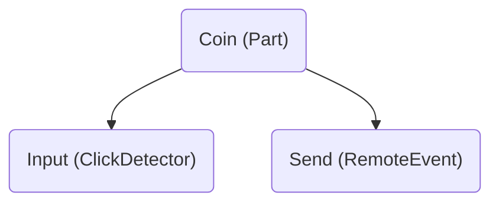

import TypeSupport from "@site/src/components/TypeSupport";

# File Types

Argon supports various file types, here is how they are transformed into Roblox instances!

## Overview

| File Type                                 | File Name                        |
| ----------------------------------------- | -------------------------------- |
| [Folder](#folder)                         | any directory                    |
| Server [Script](#scripts)                 | `*.server.lua` / `*.server.luau` |
| Client [Script](#scripts)                 | `*.client.lua` / `*.client.luau` |
| Module [Script](#scripts)                 | `*.lua` / `*.luau`               |
| XML [Model](#roblox-models)               | `*.rbxmx`                        |
| Binary [Model](#roblox-models)            | `*.rbxm`                         |
| [JSON Model](#json-model)                 | `*.model.json`                   |
| [JSON Module](#json-module)               | `*.json`                         |
| [TOML Module](#toml-module)               | `*.toml`                         |
| [Plain Text](#plain-text)                 | `*.txt`                          |
| [Localization Table](#localization-table) | `*.csv`                          |
| [Project](#project)                       | `*.project.json`                 |
| [Data File](#data-file)                   | `*.data.json` / `.data.json`     |

## Instances with Children

All mentioned file types can contain children. To do so you have to create a folder with the desired name and add `.src` or `init` file with the suffix based on the desired file type inside that folder. The only exceptions are: [Project](#project) whose immediate children are ignored and [Data File](#data-file) which is used to describe instance. Here are some examples:

### Instance + Children

<table>
  <tr>
    <th>Filesystem</th>
    <th>Roblox</th>
  </tr>

<tr>
<td>
```mermaid
graph TD;
  foo(Foo/)
  .src(.src.server.lua)
  bar(Bar.client.lua)
  baz(Baz.lua)

foo --> .src
foo --> bar
foo --> baz

````

</td>
<td>
```mermaid
graph TD;
  foo("Foo (Script)")
  bar("Bar (LocalScript)")
  baz("Baz (ModuleScript)")

  foo --> bar
  foo --> baz
````

</td>
</tr>
</table>

### (Instance + Data) + Children

<table>
  <tr>
    <th>Filesystem</th>
    <th>Roblox</th>
  </tr>

<tr>
<td>
```mermaid
graph TD;
  foo(Foo/)
  .data(.data.lua)
  bar(Bar.txt)
  baz(Baz.csv)

foo --> .data
foo --> bar
foo --> baz

````

</td>
<td>
```mermaid
graph TD;
  foo("Foo (Part)")
  bar("Bar (StringValue)")
  baz("Baz (LocalizationTable)")

  foo --> bar
  foo --> baz
````

</td>
</tr>
</table>

### Instance + (Children + Data)

<table>
  <tr>
    <th>Filesystem</th>
    <th>Roblox</th>
  </tr>

<tr>
<td>
```mermaid
graph TD;
  foo(Foo/)
  bar(Bar.json)
  bar.data(Bar.data.json)
  baz(Baz.toml)

foo --> bar
foo --> bar.data
foo --> baz

````

</td>
<td>
```mermaid
graph TD;
  foo("Foo (Folder)")
  bar("Bar (ModuleScript)")
  baz("Baz (ModuleScript)")

  foo --> bar
  foo --> baz
````

</td>
</tr>
</table>

:::danger
Only one `.src` / `init` file and one `.data` / `init.meta` can be present in the same folder!
:::

## Folder

Any directory on the filesystem will turn into a `Folder` instance with the same name. It is possible for a directory to contain certain files that change what the directory turns into described above.

## Scripts

Files with `lua` or `luau` extensions are transformed into the corresponding Roblox script instances:

- Any file ending in `.server.lua(a)` will turn into a `Script` instance.
- Any file ending in `.client.lua(a)` will turn into a `LocalScript` instance.
- Any other `.lua(a)` file will turn into a `ModuleScript` instance.

:::note
If the project has [`legacyScripts`](./project-format.mdx#project-file) setting disabled:

- `.server.lua(u)` will turn into a `Script` with a `Server` run context
- `.client.lua(u)` will turn into a `Script` with a `Local` run context

:::

## Roblox Models

Both binary (`rbxm`) and XML (`rbxmx`) models generated by Roblox Studio and other tools are supported. They get seamlessly integrated with the project tree.

<details>
  <summary>Property type support chart</summary>
  <TypeSupport />
</details>

## JSON Model

File ending with `.model.json` is used to describe multiple instances in a single file or to conveniently describe single but more complex one like `Part`. Example JSON model named `Coin.model.json`:

```json
{
  "ClassName": "Part",
  "Properties": {
    "Size": [2, 2, 2]
  }
  "Children": [
    {
      "Name": "Input",
      "ClassName": "ClickDetector",
    },
    {
      "Name": "Send",
      "ClassName": "RemoteEvent"
    }
  ]
}
```

Would be turned into these instances:



## JSON Module

Any file with the `json` extension that is not a [JSON Model](#json-model), [Project File](#project), or a [Data File](#data-file) will be turned into a `ModuleScript` that returns a table representing the same structure as the JSON file. Example JSON file:

```json
{
  "string": "abc",
  "bool": true,
  "array": [1, 2, 3],
  "object": {
    "int": 1337,
    "float": 4.2
  }
}
```

Would become a `ModuleScript` with the following `Source`:

```lua
return {
	["string"] = "abc",
	["bool"] = true,
	["array"] = {1, 2, 3},
	["object"] = {
		["int"] = 1337,
		["float"] = 4.2,
	}
}
```

JSON files are a great way to store bulk data (e.g. asset IDs) in a human-readable format.

## TOML Module

Any file with the `toml` extension will be turned into a `ModuleScript` that returns a table representing the same structure as the TOML file. Example TOML file:

```toml
string = "abc"
bool = true
array = [1, 2, 3]

[object]
int = 1337
float = 4.2
```

Would become a `ModuleScript` with the following `Source`:

```lua
return {
	["string"] = "abc",
	["bool"] = true,
	["array"] = {1, 2, 3},
	["object"] = {
		["int"] = 1337,
		["float"] = 4.2,
	}
}
```

Due to the easy to read and edit format of TOML, it can be convenient to use them as configuration files.

:::warning
There is a single limitation for TOML files: `DateTime` values are converted into `string` ones because Luau does not have a good representation of this data type.
:::

## Plain Text

Any file with the `txt` extension is transformed into a `StringValue` instance with its `Value` property set. Example:

```txt
Hello world!
```

## Localization Table

Any file with the `csv` extension is transformed into a `LocalizationTable` instance. You should follow this Roblox format:

```csv
Key,Source,Context,Example,pl
Wow,Wow!,,An expression of surprise,Łał!
```

## Project

File ending with `.project.json` is considered project which describes how the underlying instance tree should look like and how files should be processed along the way. You can learn about its format on the [Project Format](./project-format.mdx) page.

If a directory contains a file named `default.project.json`, the contents of the project file will be used instead.

:::danger
Projects that are intended to be included inside other projects should describe models, not places!
:::

## Data File

File ending with `.data.json` is considered data file which can specify:

- `className`: Sets the `ClassName` of a containing `Folder` instance.
- `properties`: A map of properties to apply on the instance.
- `keepUnknowns`: Whether children that Argon doesn't know about should be deleted.

## Limitations

Not all property types can be applied by Argon both when live-syncing and when building place files. Some common cases when you might face this problem are:

- Binary data (Terrain, CSG parts)
- `MeshPart.MeshId`
- `HttpService.HttpEnabled`

This is due to the limitations of the Roblox Studio plugin API and libraries used by Argon. You can learn more on the [Properties](./properties.mdx) page.

<details>
  <summary>Property type support chart</summary>
  <TypeSupport />
</details>

> This page is based on Rojo's [Sync Details](https://rojo.space/docs/v7/sync-details/) as Argon processes files in a very similar way.
