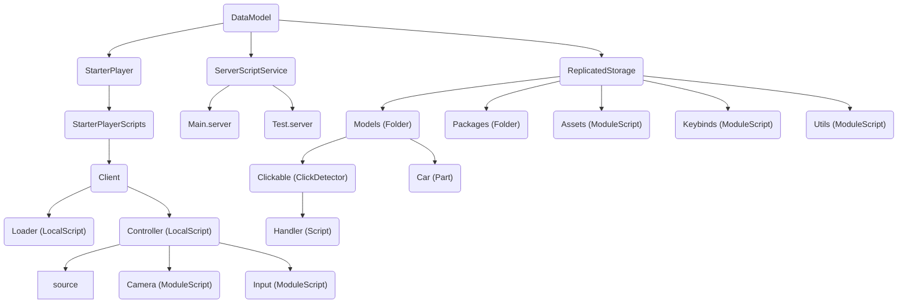

This examples shows a working game project that:

- uses recommended file structure
- takes advantage of various file types
- utilizes Wally packages

## Project

`default.project.json` located in the root directory.

```json
{
  "name": "example",
  "tree": {
    "$className": "DataModel",
    "ReplicatedStorage": {
      "$path": "src/Shared",
      "Packages": {
        "$path": "Packages"
      }
    },
    "ServerScriptService": {
      "$path": "src/Server"
    },
    "StarterPlayer": {
      "StarterPlayerScripts": {
        "$path": "src/Client"
      }
    }
  }
}
```

## Filesystem

This is how the game looks like in the filesystem.

```txt
root
│
├── Packages
├── src
│   ├── Client
│   │   ├── Loader.client.luau
│   │   └── Controller
│   │       ├── .src.client.lua
│   │       ├── Camera.client.lua
│   │       └── Input.client.lua
│   │
│   ├── Server
│   │   ├── Main.server.luau
│   │   └── Test.server.lua
│   │
│   └── Shared
│       ├── Models
│       │   ├── Clickable
│       │   │   ├── .data.json
│       │   │   └── Handler.server.lua
│       │   │
│       │   └── Car.model.json
│       │
│       ├── Assets.json
│       ├── Keybinds.toml
│       └── Utils.luau
│
├── default.project.json
└── wally.toml
```

## Roblox

And this is how the game looks like in Roblox Studio after Argon processing.



## Source Code

See this example with all source files in this GitHub [repository](TODO).
